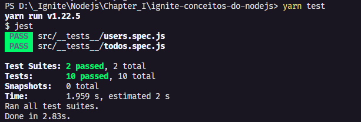

<h1 align="center">🚀 Desafio 1 do Ignite - Trilha NodeJS</h1>
<p align="center">
  Desafio 01: Conceitos do Node.js
  <br>
  
</p>
<h1 align="center">:pushpin: Sobre o desafio</h1>
Nesse desafio, foi utilizado um modelo de template que possui o esqueleto do projeto.

O template pode ser encontrado na seguinte url: **[Acessar Template](https://github.com/rocketseat-education/ignite-template-conceitos-do-nodejs)**

**Dica**: Caso não saiba utilizar repositórios do Github como template, utilize o guia em **[nosso FAQ](https://www.notion.so/ddd8fcdf2339436a816a0d9e45767664).**

É uma aplicação para gerenciar tarefas (em inglês *todos*). Será permitida a criação de um usuário com `name` e `username`, bem como fazer o CRUD de *todos*:

- Criar um novo *todo*;
- Listar todos os *todos*;
- Alterar o `title` e `deadline` de um *todo* existente;
- Marcar um *todo* como feito;
- Excluir um *todo*;

Tudo isso para cada usuário em específico (o `username` será passado pelo header).

### :keyboard: Instalação e Execução do Projeto

- Clone este repositório

```
> git clone https://github.com/danielgorgonha/ignite-conceitos-do-nodejs.git
```

- Navegue até o diretório principal do projeto

```
> cd ignite-conceitos-do-nodejs
```

- Instale as dependências com o Yarn

```
yarn
```

- Rode a suite de testes

```
yarn test
```

- Execute o projeto

```
yarn dev
```

<p align="center">
  
</p>

## :memo: Licença

Esse projeto está sob a licença MIT. Veja o arquivo [LICENSE](https://github.com/git/git-scm.com/blob/master/MIT-LICENSE.txt) para mais detalhes.

---

Feito com 💜 by <a href="https://www.linkedin.com/in/danielgorgonha/">Daniel R Gorgonha</a> :wave:
